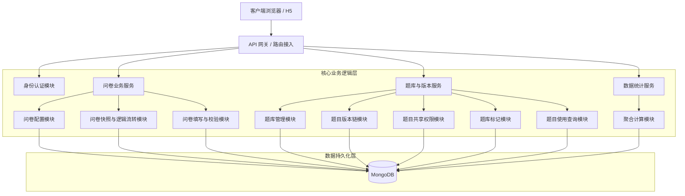
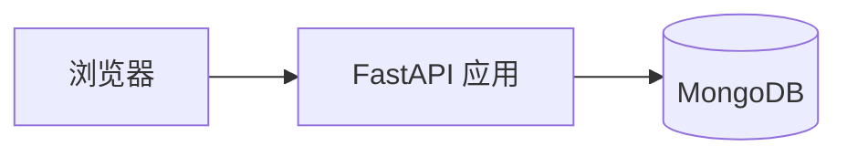
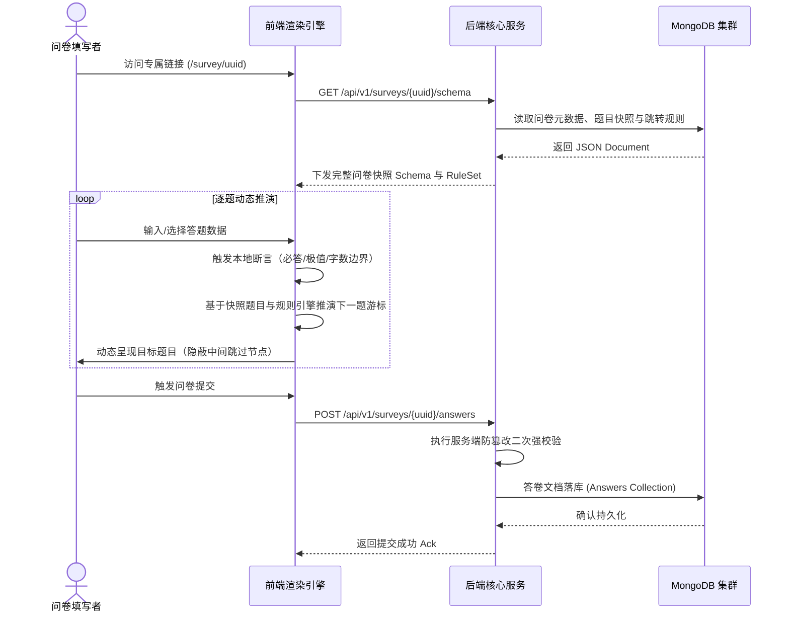
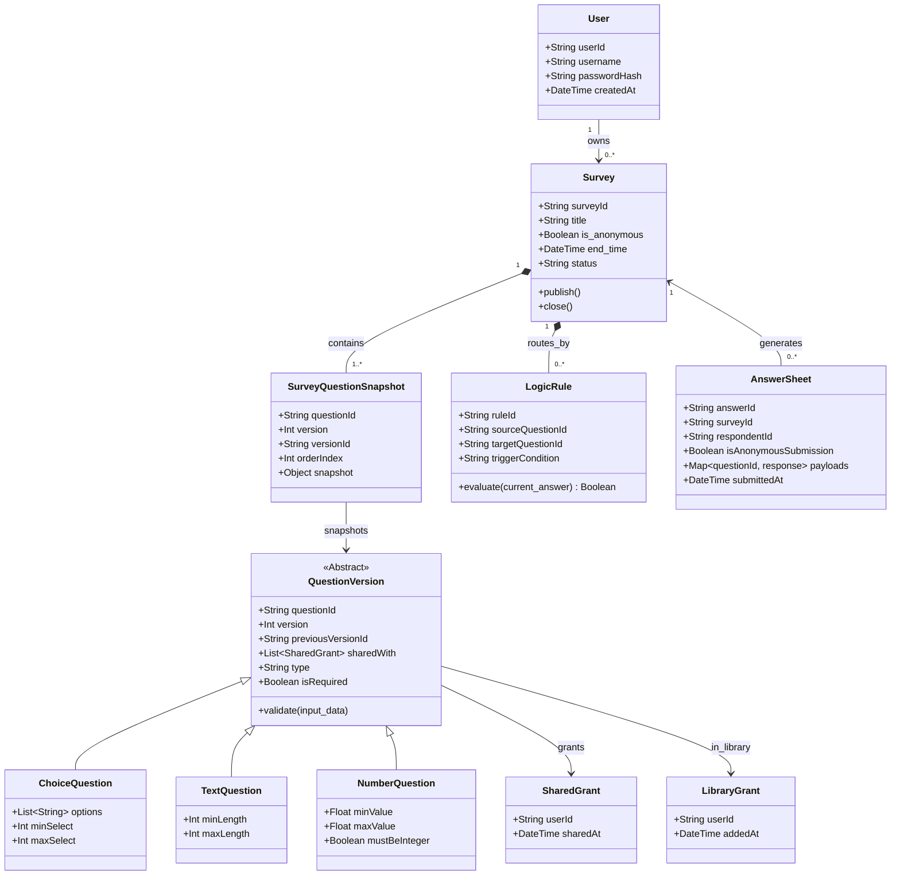
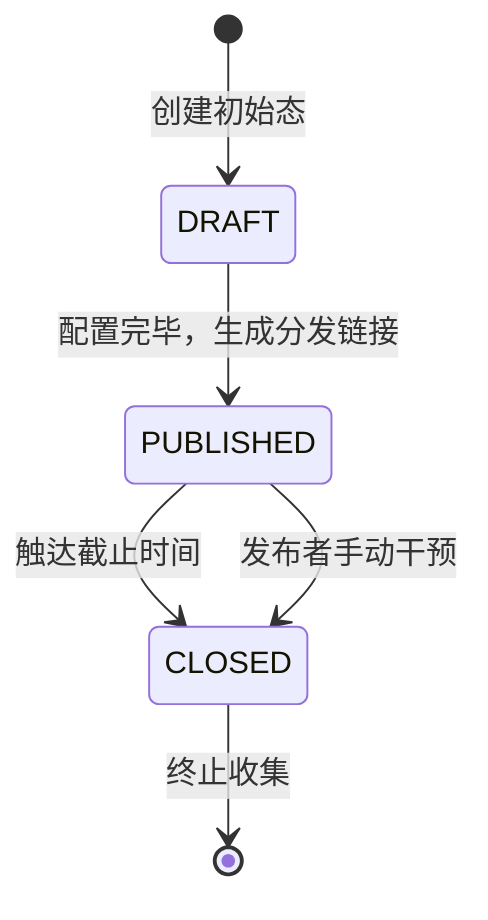

# 问卷系统架构设计文档

### 一、 系统全景概览

| 维度 | 架构级定义 |
| :--- | :--- |
| **系统定位** | 轻量级、高扩展性的在线问卷构建、分发与数据收集分析平台 |
| **核心业务目标** | 提供题目版本化管理、题目共享协作、问卷快照固化、动态逻辑跳转与实时结构化数据统计能力 |
| **受众隔离** | 问卷发布者（B端视角/管理域）、问卷填写者（C端视角/收集域） |
| **关键非功能需求** | 支撑中低频并发访问，单节点满足 500+ QPS；保证数据强隔离与输入校验可靠性 |
| **演进约束** | 架构极简，规避过度设计，但必须预留题型扩展接口与存储水平扩展空间 |

### 二、 整体架构与模块划分



| 模块名称 | 职责边界与核心行为 |
| :--- | :--- |
| **身份认证模块** | 承担用户注册鉴权、会话生命周期管理，确立租户/用户数据隔离屏障 |
| **问卷配置模块** | 维护问卷元数据（标题、状态、截止时间、是否允许匿名填写），控制问卷启停状态 |
| **题库与版本模块** | 管理独立题目定义、题目版本链、版本递增与版本详情查询 |
| **题目共享权限模块** | 管理题目所有者对指定用户的共享授权，确保被共享用户可读可用但不可改权属 |
| **题库标记模块** | 管理用户对题目的加入题库与移出题库标记，形成用户视角下的题库浏览列表 |
| **题目使用查询模块** | 汇总某个题在所有问卷中的引用情况，支撑用户在改题前判断影响范围 |
| **问卷快照与逻辑模块** | 按问卷维度选择具体题目版本，固化快照并装配动态跳转规则 |
| **填写校验模块** | 承接 C 端流量，执行输入边界断言、路径推演与答卷数据持久化，拦截非法提交 |
| **数据统计模块** | 基于问卷快照执行宏观回收率统计与微观题目聚合分析，避免题库后续变更污染历史统计 |

### 三、 技术选型与依据

| 技术领域 | 选型决定 | 核心考量依据 |
| :--- | :--- | :--- |
| **开发语言** | Python 3.11+ | 语法极简，开发敏捷，完美匹配微型项目规模与数据聚合计算场景 |
| **依赖与环境管理** | uv | Rust 构建的下一代 Python 工具，极大提升依赖解析与虚拟环境构建速度 |
| **Web 应用框架** | FastAPI | 原生异步支持，内置 Pydantic 数据验证引擎，极其契合问卷多变、嵌套的数据结构校验 |
| **主数据库** | MongoDB | 文档型 NoSQL。既适合存放 `questions` 版本文档，也适合在 `surveys` 中保存问卷题目快照 |
| **缓存与状态** | 进程内内存缓存 | 基于极小规模约束，暂缓引入独立 Redis 组件，以降低系统运维复杂度，代码层预留 Cache 接口规范 |

### 四、 部署架构与拓扑



当前实现说明：

- 仓库当前提供的是单个 FastAPI 应用实例加单个 MongoDB 实例的开发部署形态。
- MongoDB 通常通过 Docker Compose 启动，FastAPI 通过 `uv run uvicorn app.main:app --reload` 启动。
- 文档中的架构描述以当前实际交付形态为准，不描述尚未在仓库中落地的 Nginx 或多节点集群。

### 五、 核心数据流向

**链路：动态问卷加载与作答提交流程**



### 六、 核心领域模型与类设计



### 七、 关键算法与业务状态流转

**7.1 问卷生命周期状态机**



**7.2 动态路径路由算法流转**


**伪代码实现参考：**

```python
def compute_next_question(current_q: SurveyQuestionSnapshot, payload: Any, rules: List[LogicRule]) -> SurveyQuestionSnapshot:
    """基于问卷快照计算流转的下一游标"""
    current_q.validate(payload)
    
    for rule in rules:
        if rule.sourceQuestionId == current_q.id and rule.evaluate(payload):
            return survey.get_snapshot_by_question_id(rule.targetQuestionId)
            
    return survey.get_snapshot_by_order(current_q.orderIndex + 1)
```

补充约束：
对于单选题与多选题，`LogicRule.trigger_condition` 存储的是按空格分隔的选项行号组合。规则求值前必须先将用户当前答案转换为同样的标准化行号字符串，再执行全量相等比较，而不是基于单个选项做包含判断。

当前实现补充：

- `GET /api/v1/surveys/{survey_id}/schema` 当前实现返回的是问卷快照而不是题库实时版本。
- 当前实现新增 `questions` 集合，用于题目独立存储、版本链维护与共享授权。
- 当前实现的题库管理在 `questions` 集合内维护按用户记录的题库标记，不额外引入独立题库集合。
- 当前实现的题目使用查询通过扫描 `surveys.questions.questionId` 得出引用问卷列表。
- 统计模块对文本题最多返回 20 条明细，对数字题最多返回 50 条明细，用于前端展示。
